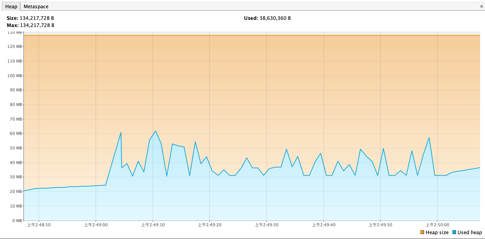
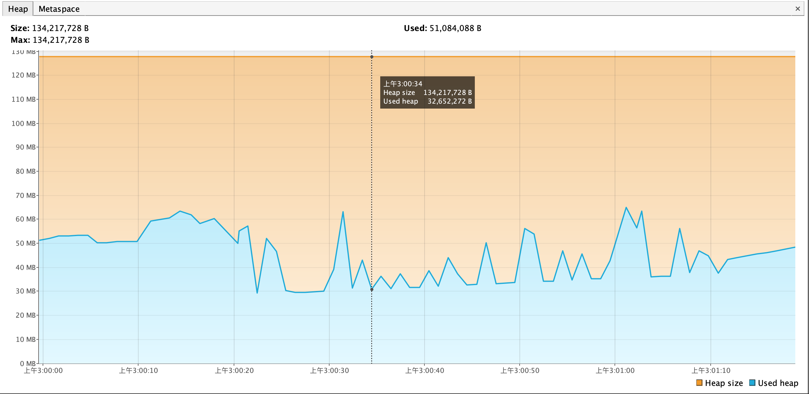
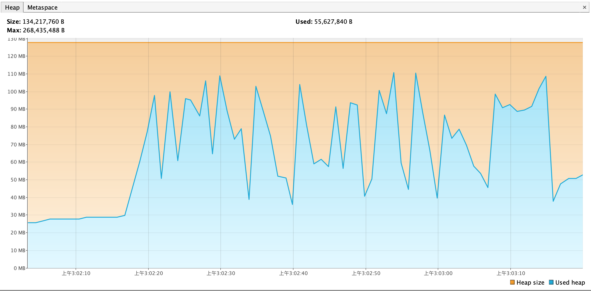

# GCLogAnalysis 日志分析

## 过滤日志
```bash
# 执行脚本，顺序执行不同 GC 算法参数和堆内存(-Xms -Xmx)参数下的 GCLogAnalysis 程序
> sh batch_GCLogAnalysis.sh

# 过滤出参数注释和对象自行次数
> cat GClog.txt |grep -E 'GC_Algorithm|执行结束|Exception'
GC_Algorithm_Parameter:+UseSerialGC; Heap_size: 128m
Exception in thread "main" java.lang.OutOfMemoryError: Java heap space
GC_Algorithm_Parameter:+UseSerialGC; Heap_size: 512m
执行结束!共生成对象次数:8895
GC_Algorithm_Parameter:+UseSerialGC; Heap_size: 1g
执行结束!共生成对象次数:9513
GC_Algorithm_Parameter:+UseSerialGC; Heap_size: 2g
执行结束!共生成对象次数:8497
GC_Algorithm_Parameter:+UseSerialGC; Heap_size: 4g
执行结束!共生成对象次数:5723
GC_Algorithm_Parameter:+UseParallelGC; Heap_size: 128m
Exception in thread "main" java.lang.OutOfMemoryError: Java heap space
GC_Algorithm_Parameter:+UseParallelGC; Heap_size: 512m
执行结束!共生成对象次数:8735
GC_Algorithm_Parameter:+UseParallelGC; Heap_size: 1g
执行结束!共生成对象次数:10718
GC_Algorithm_Parameter:+UseParallelGC; Heap_size: 2g
执行结束!共生成对象次数:11954
GC_Algorithm_Parameter:+UseParallelGC; Heap_size: 4g
执行结束!共生成对象次数:7797
GC_Algorithm_Parameter:+UseConcMarkSweepGC; Heap_size: 128m
Exception in thread "main" java.lang.OutOfMemoryError: Java heap space
GC_Algorithm_Parameter:+UseConcMarkSweepGC; Heap_size: 512m
执行结束!共生成对象次数:9606
GC_Algorithm_Parameter:+UseConcMarkSweepGC; Heap_size: 1g
执行结束!共生成对象次数:9842
GC_Algorithm_Parameter:+UseConcMarkSweepGC; Heap_size: 2g
执行结束!共生成对象次数:9198
GC_Algorithm_Parameter:+UseConcMarkSweepGC; Heap_size: 4g
执行结束!共生成对象次数:9213
GC_Algorithm_Parameter:+UseG1GC; Heap_size: 128m
Exception in thread "main" java.lang.OutOfMemoryError: Java heap space
GC_Algorithm_Parameter:+UseG1GC; Heap_size: 512m
执行结束!共生成对象次数:8926
GC_Algorithm_Parameter:+UseG1GC; Heap_size: 1g
执行结束!共生成对象次数:9146
GC_Algorithm_Parameter:+UseG1GC; Heap_size: 2g
执行结束!共生成对象次数:9693
GC_Algorithm_Parameter:+UseG1GC; Heap_size: 4g
执行结束!共生成对象次数:10102
```

## 结论：
1. 128M 情况下均发生了 OOM; 
2. 创建对象最多的出现在并行GC 用例中，说明并行 GC 的吞吐量最佳；
3. 串行 GC、并行 GC 随着对内存增大，创建对象次数增多，分别在1GB、2GB 之后下降；CMS 随内存增加变化不大；G1 随内存增加创建对象次数一直增多;
4. G1 对于大内存吞吐量表现更佳。


# 压测 Gateway-server
##  Gateway-server 使用不同 GC，用 wrk 进行压测

### 串行 GC
wrk -t4 -c100 -d60s http://localhost:8089/api/hello
Running 1m test @ http://localhost:8089/api/hello
  4 threads and 100 connections
  Thread Stats   Avg      Stdev     Max   +/- Stdev
    Latency    26.19ms   58.38ms 715.23ms   91.79%
    Req/Sec     2.94k     1.71k   11.31k    64.50%
  698815 requests in 1.00m, 83.43MB read
  Socket errors: connect 0, read 0, write 1, timeout 0
Requests/sec:  11631.34
Transfer/sec:      1.39MB



### 并行 GC
wrk -t4 -c100 -d60s http://localhost:8089/api/hello
Running 1m test @ http://localhost:8089/api/hello
  4 threads and 100 connections
  Thread Stats   Avg      Stdev     Max   +/- Stdev
    Latency    25.92ms   56.87ms 714.60ms   91.60%
    Req/Sec     2.93k     1.73k   11.65k    63.74%
  697798 requests in 1.00m, 83.31MB read
  Socket errors: connect 0, read 1, write 0, timeout 0
Requests/sec:  11610.84
Transfer/sec:      1.39MB


### CMS GC
wrk -t4 -c100 -d60s http://localhost:8089/api/hello
Running 1m test @ http://localhost:8089/api/hello
  4 threads and 100 connections
  Thread Stats   Avg      Stdev     Max   +/- Stdev
    Latency    24.38ms   54.71ms   1.10s    91.97%
    Req/Sec     3.02k     1.79k   10.40k    65.96%
  718680 requests in 1.00m, 85.80MB read
  Socket errors: connect 0, read 1, write 0, timeout 0
Requests/sec:  11963.06
Transfer/sec:      1.43MB


### G1GC
wrk -t4 -c100 -d60s http://localhost:8089/api/hello
Running 1m test @ http://localhost:8089/api/hello
  4 threads and 100 connections
  Thread Stats   Avg      Stdev     Max   +/- Stdev
    Latency    26.09ms   53.76ms 765.90ms   90.59%
    Req/Sec     2.85k     1.70k   10.32k    65.76%
  676046 requests in 1.00m, 80.71MB read
Requests/sec:  11255.50
Transfer/sec:      1.34MB



## 结论：
1. 总体看各 GC 情况下，吞吐量和延迟的差异都不大，可能是压力不够？
2. 使用CMS时，吞吐量和延迟最好；
3. CMS是堆内存波动最小，G1 堆内存波动最大。
